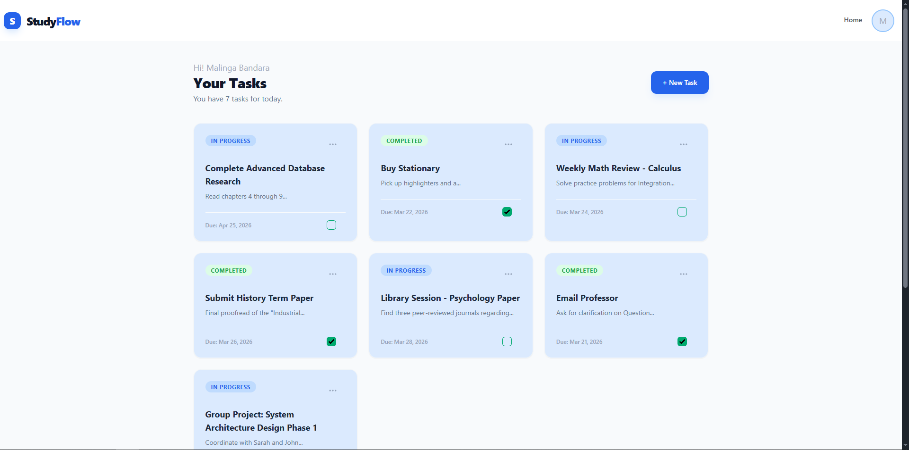
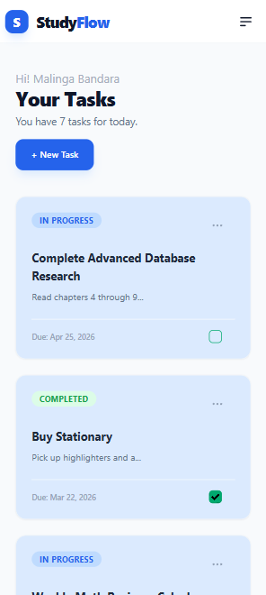
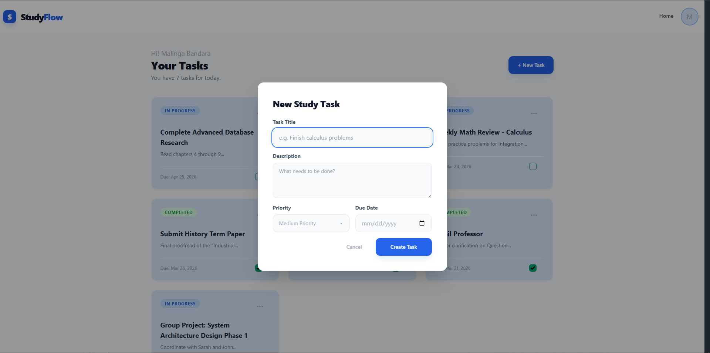
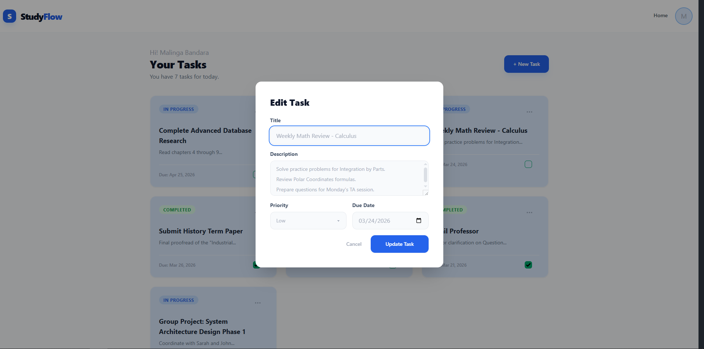
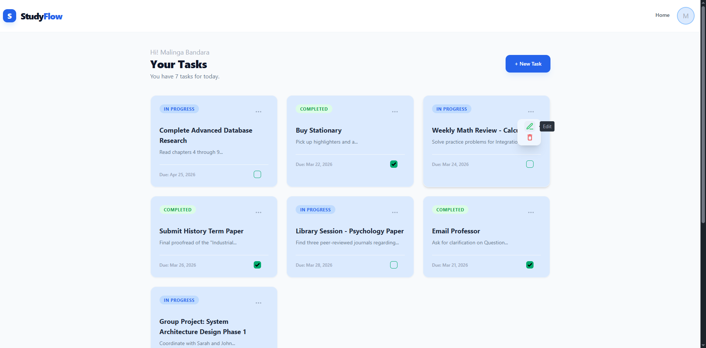
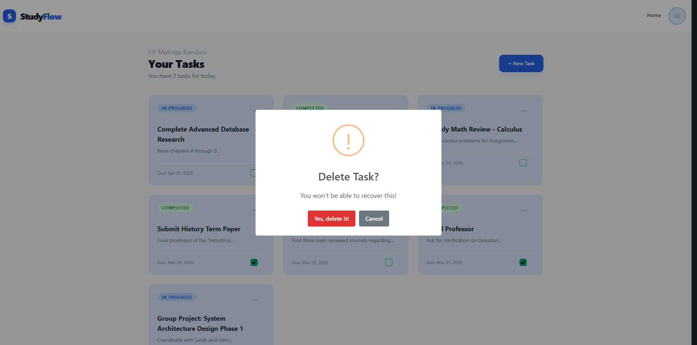
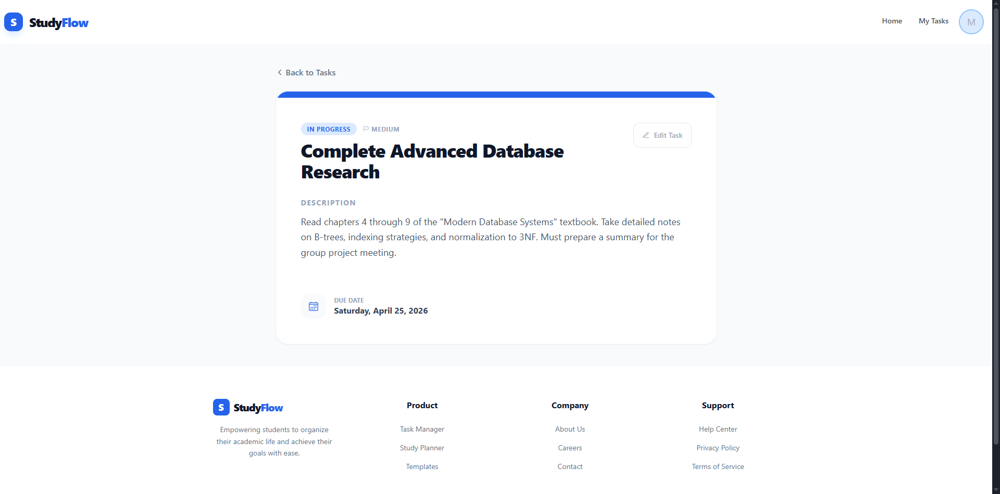

# 📚 StudyFlow

StudyFlow is a full-stack task management application built with the MERN stack.  
It helps students organize, track, and manage their study tasks efficiently with a clean and responsive UI.

---

## Features

- ✅ User Authentication (Login / Register)
- 📝 Create, Edit, Delete Tasks
- 📌 Task Status (Completed / In Progress)
- 📅 Due Dates & Priority Levels
- ⚡ Real-time UI Updates
- 🔐 Protected Routes
- 🎨 Clean & Responsive UI (Tailwind CSS)

---

## Tech Stack

### Frontend
- React.js
- React Router
- Tailwind CSS
- Axios
- React Hot Toast
- SweetAlert2

### Backend
- Node.js
- Express.js
- MongoDB
- Mongoose
- JWT Authentication

---

## Project Structure
studyflow/
|
|-- client/ #React Frontend
|-- server/ #Express Backend
|-- README.md

---

## Installation

### 1️ Clone the repository

``bash
git clone https://github.com/Achintha-Dev/studyflow.git
cd studyflow

---

### 2️⃣ Setup Backend

cd server
npm install

Create a .env file:

PORT=5000
MONGO_URI=your_mongodb_connection
JWT_SECRET=your_secret_key

Run backend:

npm run dev

---

### 3️⃣ Setup Frontend
cd client
npm install
npm run dev

---

## API Endpoints
| Method | Endpoint       | Description     |
| ------ | -------------- | --------------- |
| GET    | /api/tasks     | Get all tasks   |
| GET    | /api/tasks/:id | Get single task |
| POST   | /api/tasks     | Create task     |
| PUT    | /api/tasks/:id | Update task     |
| DELETE | /api/tasks/:id | Delete task     |

---

## Screenshots

### Landing

### Authentication

### Dashboard

### Task Management

#### Create & Edit

#### Actions

#### Details

---

## Author

Achintha Bandara
GitHub: https://github.com/Achintha-Dev

---

## Support

If you like this project, give it a ⭐ on GitHub!

---

## Live Demo

- **Frontend:** [https://studyflow-m6s23xs61-achintha-devs-projects.vercel.app](https://studyflow-m6s23xs61-achintha-devs-projects.vercel.app)
- **Backend API:** [https://studyflow-te8p.onrender.com/api](https://studyflow-te8p.onrender.com/api)

---

## Badges

